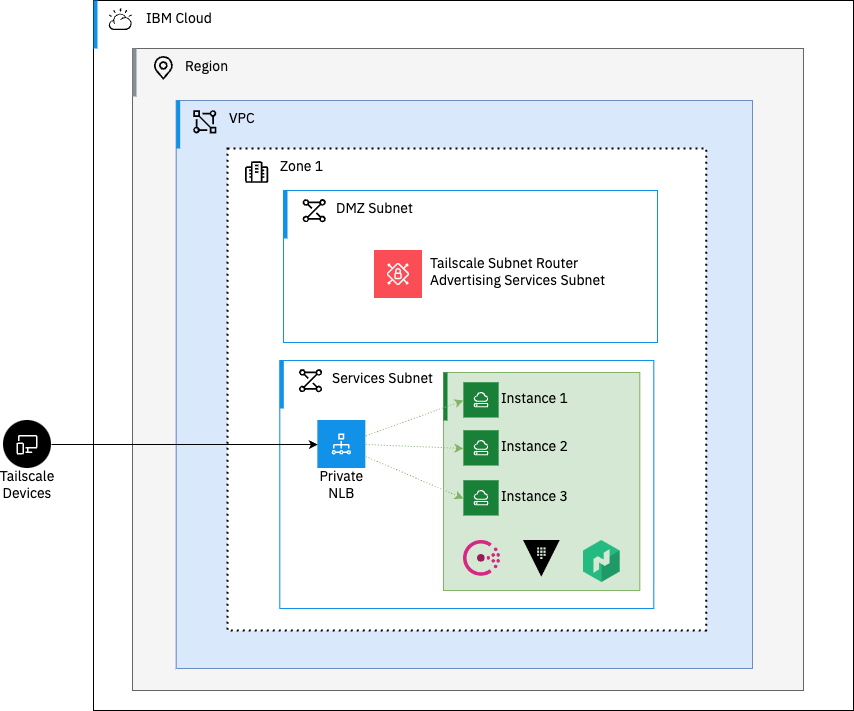

# Hashilab in IBM Cloud VPC with Tailscale Subnet Router

## Overview

Use the Tailscale [Subnet Router](https://tailscale.com/kb/1019/subnets) feature to expose a private VPC based `Hashilab` to the Tailscale network. This example will create a VPC in IBM Cloud with two subnets, one for the Tailscale subnet router and one for our services (Vault, Consul, Nomad). The subnet router will advertise the **services** subnet to the Tailscale network and allow us to connect to the services using the FQDNs we define in the private DNS zone.

## Diagram

Here is a hgh level overview of the solution: **Not complete**




## Pre-reqs

- [ ] IBM Cloud [API Key](https://cloud.ibm.com/docs/account?topic=account-userapikey&interface=ui#create_user_key)
- [ ] Tailscale [API Key](https://login.tailscale.com/admin/settings/keys)
- [ ] Tailscale [Organization](https://login.tailscale.com/admin/settings/general). This is the name of your Tailnet Organization **not** your Tailnet DNS name.
- [ ] Terraform [installed](https://developer.hashicorp.com/terraform/install) locally

## Getting started

### Clone repository and configure terraform variables

The first step is to clone the repository and configure the terraform variables.

```shell
git clone https://github.com/cloud-design-dev/ibmcloud-ts-router-hashilab.git
cd ibmcloud-ts-router-hashilab
```

Copy the example terraform variables file and update the values with your own.

```shell
cp tfvars-template terraform.tfvars
```

#### Variables

| Name | Description | Type | Default | Required |
|------|-------------|------|---------|:--------:|
| <a name="input_allowed_ssh_ip"></a> [allowed\_ssh\_ip](#input\_allowed\_ssh\_ip) | The IP address or CIDR block to allow SSH access from in to our Tailscale router instance. | `string` | `"0.0.0.0/0"` | no |
| <a name="input_cluster_size"></a> [cluster\_size](#input\_cluster\_size) | The number of worker nodes to create in the cluster. | `number` | `3` | no |
| <a name="input_existing_resource_group"></a> [existing\_resource\_group](#input\_existing\_resource\_group) | The IBM Cloud resource group to assign to the provisioned resources. | `string` | n/a | yes |
| <a name="input_existing_ssh_key"></a> [existing\_ssh\_key](#input\_existing\_ssh\_key) | The name of an existing SSH key to use for provisioning resources. If one is not provided, a new key will be generated. | `string` | `""` | no |
| <a name="input_ibmcloud_api_key"></a> [ibmcloud\_api\_key](#input\_ibmcloud\_api\_key) | The IBM Cloud API key to use for provisioning resources | `string` | n/a | yes |
| <a name="input_ibmcloud_region"></a> [ibmcloud\_region](#input\_ibmcloud\_region) | The IBM Cloud region to use for provisioning VPCs and other resources. | `string` | n/a | yes |
| <a name="input_private_dns_zone"></a> [private\_dns\_zone](#input\_private\_dns\_zone) | Name of the private DNS zone to create for the VPCs | `string` | `"internal.lab"` | no |
| <a name="input_project_prefix"></a> [project\_prefix](#input\_project\_prefix) | The prefix to use for naming resources. If none is provided, a random string will be generated. | `string` | `""` | no |
| <a name="input_tailscale_api_key"></a> [tailscale\_api\_key](#input\_tailscale\_api\_key) | The Tailscale API key | `string` | n/a | yes |
| <a name="input_tailscale_organization"></a> [tailscale\_organization](#input\_tailscale\_organization) | The Tailscale tailnet Organization name. Can be found in the Tailscale admin console > Settings > General. | `string` | n/a | yes |

### Initialize, Plan and Apply the Terraform configuration

Once you have the required variables set, you can initialize the terraform configuration and create a plan for the deployment.

```shell
terraform init
terraform plan -out=plan.out
```

If no errors are returned, you can apply the plan to create the VPCs, subnets, and compute instances.

```shell
terraform apply plan.out
```

When the provosion is complete, you should see the output of the plan, including the private IP addresses of the compute hosts, the advertised subnets, and our custom resolvers.

```plaintext
<under-construction.gif>
```

### Approve the advertised subnets in the Tailscale admin console

By default the subnet router will not advertise any of the subnets until they are approved in the Tailscale admin console. From the admin console, navigate to the Machines tab and click the subnet router instance name. On the machine details page you should see the subnets that are available to be advertised.


Under **Approved** click `Edit` and select the subnets you want to advertise and click `Save`.


### Connect to Tailscale and check connectivity

Once the subnets are approved, you can start the Tailscale app on your local machine and set the local DNS resolvers to the custom resolvers that were created in the VPC. You can find the IP addresses of the custom resolvers in the terraform output. If you happen to be using a Mac, you can set the custom resolvers in the Network settings or via the command line with the `networksetup` command:

```shell
networksetup -setdnsservers Ethernet 10.250.0.5 10.250.64.4
```

With the resolvers set, we can now start testing connectivity to our deployed services. Take one of the FQDNs from the terraform output and try to connect to it.

```plaintext
<under-construction.gif>
```

### Clean up

To remove the resources created by the terraform configuration, you can run the `destroy` command.

```shell
terraform destroy
```

## Conclusion

In this example we have deployed a Tailscale subnet router in an IBM Cloud VPC to expose private DNS services to our Tailscale network. We also created custom resolvers in the private DNS zone that allow us to connect to our private services using the FQDNs we have defined in the private DNS zone from our local machine.
